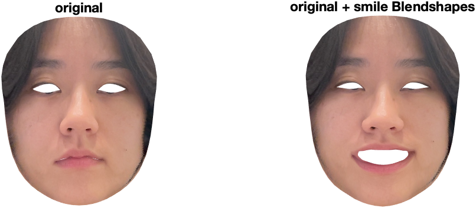

# apple_facestim_generation
Generate face stimuli using Apple ARKit 

This project is composed of 5 steps: 
1.  Get a 3D face mesh with vertices, triangular face indices, and blendshapes using the IPhone X's True-Depth camera and Apple ARKit. 
2.  Find the linear mapping between the Apple vertices and blendshapes (*LinRegressBeta.m*)
    Or you can download *BETA.mat*.
3.  Segment face parts (eyes, a nose, and a mouth) or use the whole face from the Apple mesh. *FaceParts_example.mat* contains vertices, mesh triangle indices, outline indices, and reference points for each face part and the whole face from an example Apple mesh. 
4.  Perform a "surgery" on a blank head with the obtained parts by stitching the parts to user-defined locations.
5.  Animate the final face using the mapping from Step 3.

All codes were developed in MATLAB except for the IPhone app (written in Swift). 

## Step 1
Thanks to the IPhone X's face-capture ability and Apple's ARKit, we can obtain a basic 3D face mesh. This data include 1220 vertices (x,y,z coordinates), 2304 triangular faces, and 52 blendshapes. Blendshapes are specific facial features that can be used to create a diverse array of facial expressions. Their values range from 0.0 to 1.0. An example is *tongueOut*, which measures the extension of a tongue of the person facing the camera. The full list of blendshape locations can be found here (https://developer.apple.com/documentation/arkit/arfaceanchor/blendshapelocation).

To get the face mesh data, build an app **_FaceDataRecorder.xcodeproj_** to your iphone. XCode is an IDE for MacOS so if you are a windows user, you will need to get a virtual mac or rent a mac in the cloud. 

**_FaceDataRecorder.xcodeproj_** is a brainchild of [FaceCaptureX](http://prostheticknowledge.tumblr.com/post/167520295696/iphone-x-face-motion-capture-into-houdini-were) Elisha Hung. Make sure to collect a movie (~1 minute) making various facial expressions (smile, surprised) and movements of the face (wink, furrowed brow) to activate different blendshapes. I've updated the code so that the text output contains camera projection matrix and image resolution, which are used for mapping texture later. After building the app, launch it, set to "Record", and click "Capture". 

Use faceData_readLog.m to parse the text file from the app.

## Step 2
After you collect enough face mesh data i.e. collect various facial expressions that include all the blendshape coefficients, you can find the linear mapping between the 52 blendshapes and 1220 vertices. This mapping will be useful later to animate a random face with arbitrary blendshape values. Note that this is only possible because the indices of an Apple face mesh never change. 
    
Basically you run a linear regression of vertices against the blendshapes:

    Y = Xb 
where **_Y_** is x,y,z coordinates of mesh vertices (number of frames x 3660) and **_X_** is blendshape coefficients (number of frames x 53). **_b_**, or beta (53 x 3660) tells how much a single blendshape influences/changes a single coordinate point.

Usually you pick a ridge weight for which beta values become stable. The beta's provided here are generated with the ridge weight = 0.1.

Here is a result of applying the betas applied to a random face mesh.

(If you want to know more about ridge regression: https://ncss-wpengine.netdna-ssl.com/wp-content/themes/ncss/pdf/Procedures/NCSS/Ridge_Regression.pdf) 

## Step 3
You can infer the indices of part vertices by looking at the betas for blendshapes that are associated with each part. For example, blendshapes that are related to the left eye, such as *eyeLookOutLeft*, *eyeLookInLeft*, and *eyeLookDownLeft*, will have high absolute beta values for the vertices in the left eye region.

Or you can manually select vertices that correspond to left and right eye, nose, and mouth using datacursormode in MATLAB. 
Here, I provide the indices of each face part along with the boundary indices. Also, I arbitrarily chose a reference point(or two reference points for the nose), i.e.centroid, for each part which will be necessary in Step 4 for stitching the part to a new location.

The reference points are colored in green.

## Step 4 
Stitching a part mesh to a blank head requires the following steps:
1.  In-plane rotation of the part across the y-axis (ex. vertical eye, upside down nose)
2.  Define the location on the blank head where the reference point will be attached to
3.  Bring the part towards the target location by minimizing the distance between the reference point and the target point
3(a).  Minimize the distance between the boundary of the part and the blank head through the optimzation protocol

5.  Remove the the blank head's vertices that are occluded by the part mesh
6.  Stitch the face part's boundary vertices to the base head's unconnected vertices through Delaunay Triangulation
7.  Smooth the stitched and neighboring areas

3D transformation can be formulated as 4-by-4 matrix operations:
https://www.tutorialspoint.com/computer_graphics/3d_transformation.htm

Importantly, if you select an inappropriate target location (too far from the base head or the part is too big to stitch to the corresponding area in the blank head, the surgery will not work)

Below are a couple of examples of stitching a part to the head in different locations.

## Step 5
Now you can animate the outcome of Step 4 using the **_b_** (betas) from Step 2. For example, if you want to create a face with closed eyes, set blendshapes *eyeBlinkL* and *eyeBlinkR* to 1, and calculate Y = Xb. 

Consult StimGenExample.m for creating a face stimulus from scratch and animating it to a new expression.

https://github.com/user-attachments/assets/527afdc1-2307-4c6b-8c7f-2c504a0c55fd

## Step 6
You can also add texture to the face mesh using the photos captured by the app. Make sure that the photo and the mesh information are from the same frame. See Texturemapping.m. You can do Step 5 with a textured mesh as well. 

